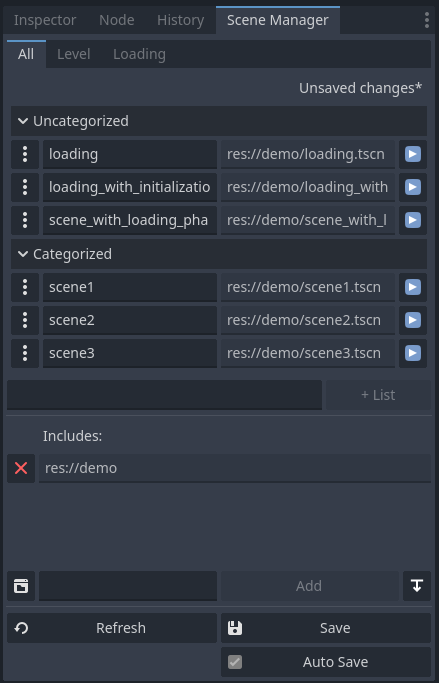
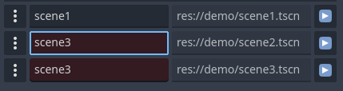
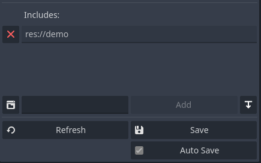
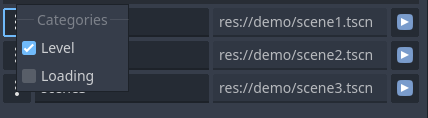

# Scene Manager

## In Progress
**Current Changes**:
- Scenes can be specified as enums now to prevent typo errors using strings
- Shader is removed to make it not depend ont it, especially for web builds that can conflict.
- Restructuring files and folder structure

**TODO**:
- Design API for modular loading screens without hard coding transitions in the scene manager itself
- Further clean up the code to remove the loading scene related code.

<p align="center">

</p>

A tool to manage transition between different scenes for Godot 4, featuring an editor for adding scenes and an auto-generated scene file.

Auto-complete node incorporated and modified from https://github.com/Lenrow/line-edit-complete-godot by Lenrow.

## Features

* A tool menu structure to manage and categorize your scene in the editor
* Duplication check for scene names and list names
* Include folder feature in UI to only add scenes in the specified folder or the scene file itself
* Categorization for scenes
* Can go back to a previous scene using the ring buffer the `Scene Manager` tracks. Size of the ring buffer can be adjusted.
* Reset `Scene Manager` function to assume the current scene as the first ever seen scene and resetting the back buffer
* Default fade in and fade out to black built-in
* You can create instance of a scene just by calling the scene with a key
* Project/Settings includes addon settings to customize the `Scene Manager`
  * Can specify the location of the `scene.gd` file that's generated
  * Global default fade in and out times for the built-in fade transition
  * Auto save is an internal property setting the addon uses to keep track of whether or not to automatically save changes made to the scene manager tool
* Support for the following signals to get information throughout the scene loading:
  * load_finished
  * load_percent_changed(value: int)
  * scene_loaded
  * fade_in_started
  * fade_out_started
  * fade_in_finished
  * fade_out_finished
* Ability to navigate to the scene path in filesystem on godot when clicked on scene address in Scene Manager tool
* Can open a desired scene from Scene Manager tab

## How To Use?

1. Copy and paste `scene_manager` folder which is inside `addons` folder. (don't change the `scene_manager` folder name)
2. From editor toolbar, choose **`Project > Project Settings...`** then in **`Plugins`** tab, activate scene_manager plugin.
3. Use `Scene Manager` tab on right side of the screen (on default godot theme view) to manage your scenes.
4. After you are done with managing your scenes, always **save** your changes so that your changes have effect inside your actual game.

> **Note**: After activating `Scene Manager` tool, you have access to **SceneManager** script globally from anywhere in your scripts. For more information, read [SceneManager](#scenemanager) section.

> **Note**: This tool saves your scenes data inside `res://scenes.gd` file by default. If you want to have your latest changes and avoid redefining your scene keys, **do not** remove it, **do not** change it or modify it in anyway.

## Tool View

This is the tool that you will see on your right side of the godot editor after activating `scene_manager` plugin. With the **Add** button under scenes categories, you can create new categories to manage your scenes which will show up as tabs. Note that it will notify you if there's unsaved changes to the scene information in the top right corner. Scenes can be loaded directly with the button on the right.

<p align="center">

</p>

### Double key checker

If editing of a scene key causes at least two keys of another scene match, both of them will get red color and you have to fix the duplication, otherwise the plugin does not work properly as you expect it to work. Editing scene keys will also automatically normalize the formatting as you type to lower case and underscores as spaces to keep everything in the same style and make it valid to store in a dictionary. Symbols and other invalid characters can't be entered and will be stripped out.

<p align="center">

</p>

### Include Folder

Every folder and file that is added inside this section will be included and scenes inside them will get added to the tool with default keys matching the file name.

<p align="center">

</p>

## Scene Menu

Every scene has a button beside them which will open up a menu to configure the category of that specific scene.

<p align="center">

</p>

# Demo

## Demo Description

1. Scene \<number\>: this button calls `change_scene` function and goes to next scene.
2. Reset: after pressing this button, you don't go back to the previous seen scenes by pressing back button but if you do, you actually restart your scene.
3. Reload: reloads the current scene.
4. Back: goes back to previous scene. (or restarts if there is no previous scene)
5. Nothing: just shows a transition but actually does nothing.
6. Exit: after fading out of the screen, quits the game.

## Demo Code

> **Note**: You can use `SceneManager` node in your game after you activated `scene_manager` plugin.

### Simple Example Without any Loading Screen

```gdscript
extends Button

@export var scene: String
@export var fade_out_speed: float = 1.0
@export var fade_in_speed: float = 1.0
@export var fade_out_pattern: String = "fade"
@export var fade_in_pattern: String = "fade"
@export var fade_out_smoothness = 0.1 # (float, 0, 1)
@export var fade_in_smoothness = 0.1 # (float, 0, 1)
@export var fade_out_inverted: bool = false
@export var fade_in_inverted: bool = false
@export var color: Color = Color(0, 0, 0)
@export var timeout: float = 0.0
@export var clickable: bool = false
@export var add_to_back: bool = true

@onready var fade_out_options = SceneManager.create_options(fade_out_speed, fade_out_pattern, fade_out_smoothness, fade_out_inverted)
@onready var fade_in_options = SceneManager.create_options(fade_in_speed, fade_in_pattern, fade_in_smoothness, fade_in_inverted)
@onready var general_options = SceneManager.create_general_options(color, timeout, clickable, add_to_back)

func _ready() -> void:
 var fade_in_first_scene_options = SceneManager.create_options(1, "fade")
 var first_scene_general_options = SceneManager.create_general_options(Color(0, 0, 0), 1, false)
 SceneManager.show_first_scene(fade_in_first_scene_options, first_scene_general_options)
 # code breaks if scene is not recognizable
 SceneManager.validate_scene(scene)
 # code breaks if pattern is not recognizable
 SceneManager.validate_pattern(fade_out_pattern)
 SceneManager.validate_pattern(fade_in_pattern)

func _on_button_button_up():
 SceneManager.change_scene(scene, fade_out_options, fade_in_options, general_options)

func _on_reset_button_up():
 SceneManager.reset_scene_manager()

func _on_loading_scene_button_up():
 SceneManager.set_recorded_scene(scene)
 SceneManager.change_scene("loading", fade_out_options, fade_in_options, general_options)

func _on_loading_scene_initialization_button_up():
 SceneManager.set_recorded_scene(scene)
 SceneManager.change_scene("loading_with_initialization", fade_out_options, fade_in_options, general_options)

func _on_pause_and_resume_button_up():
 await SceneManager.pause(fade_out_options, general_options)
 await get_tree().create_timer(3).timeout
 await SceneManager.resume(fade_in_options, general_options)
```

### Simple Example With Loading Screen

```gdscript
extends Control

# Nodes
@onready var progress: ProgressBar = find_child("Progress")
@onready var loading: AnimatedSprite2D = find_child("Loading")
@onready var next: Button = find_child("Next")

func _ready():
 SceneManager.load_percent_changed.connect(percent_changed)
 SceneManager.load_finished.connect(loading_finished)
 SceneManager.load_scene_interactive(SceneManager.get_recorded_scene())

func percent_changed(number: int) -> void:
 progress.value = number

func loading_finished() -> void:
 loading.visible = false
 next.visible = true

func _on_next_button_up():
 var fade_out_options = SceneManager.create_options(1.0, "scribbles", 0.2, true)
 var fade_in_options = SceneManager.create_options(1.0, "crooked_tiles", 0.2, true)
 var general_options = SceneManager.create_general_options(Color(0, 0, 0), 0, false, true)
 SceneManager.change_scene_to_loaded_scene(fade_out_options, fade_in_options, general_options)
```

### More Complex Example With Loading Screen for Scenarios That Scenes Need Some Time in Background

#### First Part

**Note**: This example is for someone who needs to generate a world in the background and then show the scene to the user or someone who generally needs to load some data in the background and then show the new scene to the user/player.

```gdscript
extends Control

# Nodes
@onready var progress: ProgressBar = find_child("Progress")
@onready var loading: AnimatedSprite2D = find_child("Loading")
@onready var next: Button = find_child("Next")
@onready var label: Label = find_child("Label")

var gap = 30

func _ready():
 SceneManager.load_percent_changed.connect(percent_changed)
 SceneManager.load_finished.connect(loading_finished)
 SceneManager.load_scene_interactive(SceneManager.get_recorded_scene())

func percent_changed(number: int) -> void:
 # the last `gap%` is for the loaded scene itself to load its own data or initialize or world generate or ...
 progress.value = max(number - gap, 0)
 if progress.value >= 90:
  label.text = "World Generation . . ."

func loading_finished() -> void:
 # All loading processes are finished now
 if progress.value == 100:
  loading.visible = false
  next.visible = true
  label.text = ""
 # Loading finishes and world initialization or world generation or whatever you wanna call it will start
 elif progress.value == 70:
  SceneManager.add_loaded_scene_to_scene_tree()
  gap = 0
  label.text = "Scene Initialization . . ."

func _on_next_button_up():
 var fade_out_options = SceneManager.create_options(1.0, "scribbles", 0.2, true)
 var fade_in_options = SceneManager.create_options(1.0, "crooked_tiles", 0.2, true)
 var general_options = SceneManager.create_general_options(Color(0, 0, 0), 0, false, true)
 SceneManager.change_scene_to_existing_scene_in_scene_tree(fade_out_options, fade_in_options, general_options)
```

#### Second Part

Assume this part is in the new scene which needs some time in the background:

**Note**: This part emits the signal of `load_percent_changed` of SceneManager to inform the loading screen to change the percentage to inform user that something is happening.
**Note**: After the loading process is finished, `load_finished` will be called to inform the loading screen which everything is ready to change to the new scene.

```gdscript
extends Control

var t = Timer.new()
var count = 0

func _ready():
 self.add_child(t)
 t.timeout.connect(_on_timeout)
 t.start(1)

func _on_timeout():
 count += 1
 if count == 1:
  SceneManager.load_percent_changed.emit(80 + randi_range(0, 9))
 elif count == 2:
  SceneManager.load_percent_changed.emit(90 + randi_range(0, 9))
 if count == 3:
  SceneManager.load_percent_changed.emit(100)
  SceneManager.load_finished.emit()
  t.timeout.disconnect(_on_timeout)
 t.start(count + 1)
```

## SceneManager

### Signals

1. load_finished => signal fires when interactively loading a scene finishes
2. load_percent_changed(value: int) => signal fires when interactively loading a scene progress percentage updates
3. scene_changed => signal fires when scene changes
4. fade_in_started => signal fires when fade in starts
5. fade_out_started => signal fires when fade out starts
6. fade_in_finished => signal fires when fade in finishes
7. fade_out_finished => signal fires when fade out finishes

### Methods

1. `set_back_limit`(**input**: int) -> void:
    * Limits how much deep scene manager is allowed to record previous scenes which affects in changing scene to `back`(previous scene) functionality.
    * Allowed `input` values:
      1. input =  0 => we can not go back to any previous scenes
      2. input >  0 => we can go back to `input` or less previous scenes
2. `clear_back_buffer`() -> void:
    * Clears the back buffer and resets the ring buffer.
3. `create_load_options`(
    - **node**: String = DEFAULT_TREE_NODE_NAME,
    - **mode**: SceneLoadingMode = SceneLoadingMode.SINGLE,
    - **clickable**: bool = true,
    - **fade_out_time**: float = ProjectSettings.get_setting(SceneManagerConstants.SETTINGS_FADE_OUT_PROPERTY_NAME, SceneManagerConstants.DEFAULT_FADE_OUT_TIME),
    - **fade_in_time**: float = ProjectSettings.get_setting(SceneManagerConstants.SETTINGS_FADE_IN_PROPERTY_NAME, SceneManagerConstants.DEFAULT_FADE_IN_TIME),
    - **add_to_back**: bool = true
    <br>) -> SceneLoadOptions:
   * Creates `SceneLoadOptions` object for `load_scene` function.
4. `create_scene_instance`(**key**: Scenes.SceneName, **use_sub_threads** = false) -> Node:
    * Returns scene instance of passed scene key (blocking)
5. `get_scene`(**key**: Scenes.SceneName, **use_sub_threads** = false) -> PackedScene:
    * Returns PackedScene of passed scene key (blocking)
6. `load_scene`(**scene**: Scenes.SceneName, **load_options**: SceneLoadOptions = create_load_options()) -> void:
    * Loads the scene if scene enum isn't None, otherwise nothing happens.
    * Optional **load_options** contains configurations you can modify to adjust the scene loading behavior. If not provided, a default one will be created. The options available are the node name, loading mode, fade out time, fade in time, whether it's clickable, and whether to add it to the back ring buffer.
7. `unload_scene`(**scene**: Scenes.SceneName) -> void:
    * Unloads the specified scene from the tree.
    * Throws an assert error if the scene hasn't been loaded.
8. `go_back`() -> void:
    * Changes the scene back to the previous in `SINGLE` mode.
9. `reload_current_scene`() -> void:
    * Reloads the currently loaded scene.
10. `exit_game`() -> void:
    * Exits the game completely.
11. `add_loaded_scene_to_scene_tree`() -> void:
    * Imports loaded scene into the scene tree but doesn't change the current scene
    * Mainly used when your new loaded scene has a loading phase when added to scene tree
    * So to use this, first has to call `load_scene_interactive` to load your scene and then have to listen on `load_finished` signal and after the signal emits, you call this function and this function adds the loaded scene to the scene tree but exactly behind the current scene so that you still can not see the new scene
12. `change_scene_to_existing_scene_in_scene_tree`(**load_options**: SceneLoadOptions = create_load_options()) -> void:
    * When you added the loaded scene to the scene tree by `add_loaded_scene_to_scene_tree` function, you call this function after you are sure that the added scene to scene tree is completely ready and functional to change the active scene
13. `load_scene_interactive`(**key**: Scenes.SceneName, **use_sub_threads** = false) -> void:
    * Loads scene interactive.
    * **Note**: Connect to `load_percent_changed(value: int)` and `load_finished` signals to listen to updates on your scene loading status.
14. `get_loaded_scene`() -> PackedScene:
    * Returns the loaded scene. If the scene isn't loaded, will block and wait until the loaded scene is ready.
15. `change_scene_to_loaded_scene`(**load_options**: SceneLoadOptions) -> void:
    * Changes scene to interactively loaded scene.
16. `pop_previous_scene`() -> Scenes.SceneName:
    * Pops from the back stack and returns previous scene (scene before current scene)
17. `previous_scenes_length`() -> int:
    * Returns how many scenes there are in list of previous scenes.
18. `set_recorded_scene`(**key**: Scenes.SceneName) -> void:
    * Records a scene key to be used for loading scenes to know where to go after getting loaded into loading scene or just for next scene to know where to go next.
19. `get_recorded_scene`() -> Scenes.SceneName:
    * Returns recorded scene by `set_recorded_scene` function.
20. `pause`(**fade_out_time**: float, **general_options**: SceneLoadOptions = create_load_options()) -> void:
    * Just executes the fade out animation.
    * Use it with `resume` function when you need to do something but do not want the player to see it.
21. `resume`(**fade_in_time**: float, **general_options**: SceneLoadOptions = create_load_options()) -> void:
    * Just executes the fade in animation.
    * Use it with `pause` function when you need to do something but do not want the player to see it.