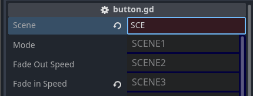

# Scene Manager API

## Scene Enum
The enum `Scenes.SceneName` is auto-generated by the `manager.gd` script in the `scenes.gd` file as scenes are loaded and named in the tool view. Note there will always be a `NONE` enum to specify no scene. The location of the `scenes.gd` file can be specified in the Project Settings. 

<p align="center">

</p>

In this example, the enums created will be `SCENE2` and `SCENE3` along with the default `NONE`. These enums will be used to specify which scene to load using `load_scene`.

The `Scenes.SceneName` can also be set as an export property in the editor inspector using the `SceneResource` class. 

```gdscript
@export var scene: SceneResource
```

<p align="center">

</p>

When doing this, a special text box will have an autocomplete list to show all available scenes it can be set. This editor property will automatically convert the provided text into a valid enum in the background as this value will be stored in the resource, which can be accessed by the `scene_value` variable in the resource. If the text box has an invalid scene, it will highlight red.

## Loading Scenes
```gdscript
func load_scene(scene: Scenes.SceneName, load_options: SceneLoadOptions = create_load_options()) -> void:
```

`load_scene` is the main function call in `SceneManager` for loading scenes into the tree. It takes an enum `Scenes.SceneName` for the scene to load and an optional parameter `load_options` which is a class of parameters in `SceneLoadOptions`. If not provided, it will use the defaults in the class.

```gdscript
const DEFAULT_FADE_TIME: float = 1.0
const DEFAULT_TREE_NODE_NAME: String = "World"

class SceneLoadOptions:
	var node_name: String = DEFAULT_TREE_NODE_NAME
	var mode: SceneLoadingMode = SceneLoadingMode.SINGLE
	var fade_out_time: float = DEFAULT_FADE_TIME
	var fade_in_time: float = DEFAULT_FADE_TIME
	var clickable: bool = true
	var add_to_back: bool = true
```

Any of the variables can be overwritten to customize how the scene will load.

- `node_name` is the parent node the new scene will load under. By default, a `World` node will be created and all scenes will go under it. Any name can be provided as long as it's a valid node name.
- `mode` is how the scene will load onto the tree.
    - `SceneLoadingMode.SINGLE` will load the scene and remove all other loaded scenes.
    - `SceneLoadingMode.SINGLE_NODE` will load the scene under the `node_name` while removing all other scenes loaded under the node.
    - `SceneLoadingMode.ADDITIVE` will load the scene under the `node_name` without doing anything else to the other loaded scenes.
- `fade_out_time` is how long it takes to black out the screen when loading. Default is 1 second.
- `fade_in_time` is how long it takes for the black screen to disappear. Default is 1 second.
- `clickable` determines whether or not to block mouse input to the screen while loading a scene. Default is to block input.
- `add_to_back` determines whether or not to add the loaded scene into the back ring buffer so it can go back to the scene. This option only affects SINGLE scene loading currently. Default is true.

### Details about scene loading modes
The `SceneLoadingMode` mimics how Unity loads scenes with their Single and Additive loading, with an extra mode specific for Godot due to how scenes work in this engine. The following example shows how the Godot tree will look like with the different load modes.

<p align="center">

</p>

Take the diagram above that shows the tree when the game is loaded. Autoload will create the `SceneManager` and `Scenes` node (and any other autoload classes), then move the currently loaded scene under the default World node (this is from the `_on_initial_setup` code in the `SceneManager`). Normally, the scene node will be under the root tree directly, but the `SceneManager` moves it to keep the behavior consistent with how the scene loading works.

<p align="center">

</p>

If we load Scene #2 with the default scene loading mode, which is **SINGLE**, then the World node is deleted along with the children scene, then replaced with a new World node and Scene #2 as a child.

<p align="center">

</p>

If we load a UI scene instead, like a player HUD or some other UI element, and use **ADDITIVE** and set the `node_name` to UI, then a new node UI will be created and the UI scene will be added as a child underneath. The original scene under World is left alone.

<p align="center">

</p>

We could also additively load another scene (Scene #3) under the first one in the default World node.

<p align="center">

</p>

Now, if we load Scene #4, but specify **SINGLE_NODE** mode under the default World node, then the `SceneManager` will delete the World node and all the child scenes under it, create a new World node, and have Scene #4 as a child. Note that the UI node remains, so any UI scene that was previously loaded will still be on the screen.

<p align="center">

</p>

Finally, we load Scene #5 with **SINGLE** loading and under `node_name` Foo. What this will do is remove all scene related parent nodes (World and UI), deleting them and all children scenes. Then a new node Foo will be created and Scene #5 will be loaded and placed as a child.

The different modes allow for creative freedom on how to handle scene loading in Godot with more flexibility compared to Unity since a scene is just another node in Godot.

> If you want the simplest use case, the default **SINGLE** loading without worrying about node names will work just fine.

## Other Functions
There are additional helper functions for changing the scenes the manager supports.

> Note these functions are still being adjusted and worked on.

- `go_back` will load the scene on the back buffer to go back to the previous scene. Note this will load the scene in **SINGLE** mode so all other scenes in the tree will be removed. Note if the back buffer size was set to 0, then nothing will happen as there will be nothing in the buffer.
- `reload_current_scene` will load the current scene again in **SINGLE** mode.
- `exit_game` quits the game immediately.